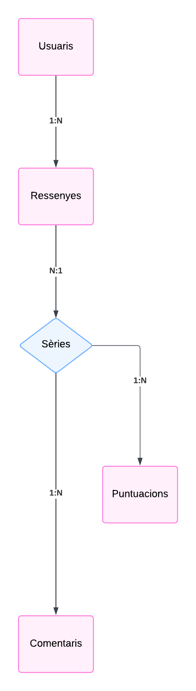

# Documentació
---
## Índex
- [Introducció](#introducció)
- [Col·leccions de MongoDB](#colleccions-de-mongodb)
  - [Usuaris (`users`)](#1-usuaris-users)
  - [Sèries (`series`)](#2-sèries-series)
  - [Ressenyes (`reviews`)](#3-ressenyes-reviews)
- [Relacions Incloses](#relacions-incloses)
---

## Introducció
Aplicació per **gestionar ressenyes de sèries**. Els usuaris poden escriure opinions sobre les sèries, classificar-les, i comentar. 

---

## Col·leccions de MongoDB

### 1. **Usuaris (`users`)**
Contindrà la informació bàsica dels usuaris.
- **Camps:**
  - `_id`: Identificador únic de l'usuari.
  - `name`: Nom de l'usuari.
  - `email`: Correu electrònic de l'usuari.
  - `reviews`: Array de referències a les seves ressenyes.
  - `password`: Contrasenya (Aquesta s'implementa només per simular el login com a gestor de sèries, no faria falta perquè només agafaríem les altres dades.)

### 2. **Sèries (`series`)**
Contindrà informació bàsica de les sèries.
- **Camps:**
  - `_id`: Identificador únic de la sèrie.
  - `name`: Nom de la sèrie.
  - `release_date`: Data de llançament.
  - `average_score`: Puntuació mitjana de la sèrie.
  - `reviews`: Array d'identificadors de ressenyes.

### 3. **Ressenyes (`reviews`)**
Gestiona les opinions i puntuacions dels usuaris per a les sèries.
- **Camps:**
  - `_id`: Identificador únic de la ressenya.
  - `user_id`: Identificador de l'usuari que ha fet la ressenya.
  - `series_id`: Identificador de la sèrie associada.
  - `comment`: Contingut de la ressenya.
  - `score`: Valoració donada.
  - `date`: Data de creació o modificació.

---

## Relacions incloses

1. **Usuaris a Ressenyes (1:N)**  
   Cada usuari pot escriure diverses ressenyes.

2. **Ressenyes a Sèries (N:1)**  
   Diverses ressenyes poden estar associades a una mateixa sèrie.

3. **Sèries a Puntuacions (1:N)**  
   Cada sèrie pot tenir moltes puntuacions.
---

